# 算法

## 大O表示法
### 常见大O表示形式
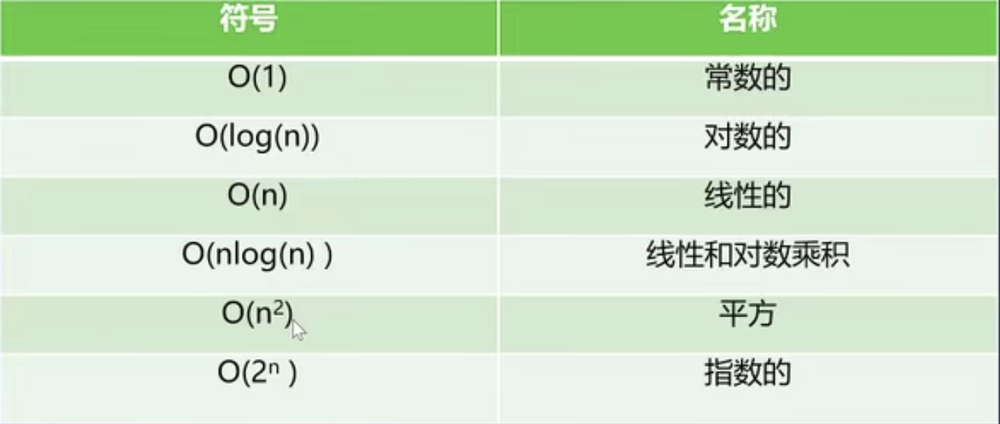

### 效率
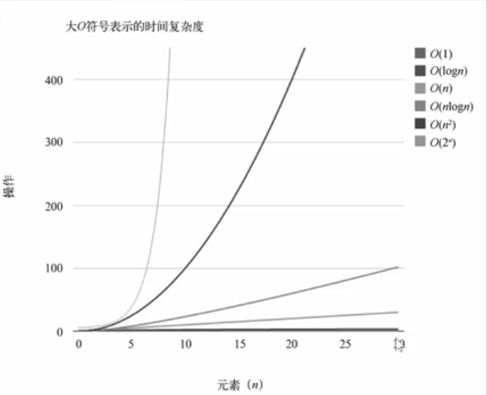

### 推到大O表示法的方式
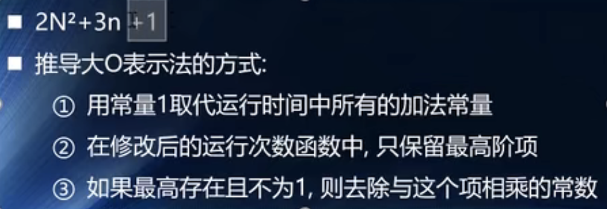

## 排序算法
### 常见排序算法
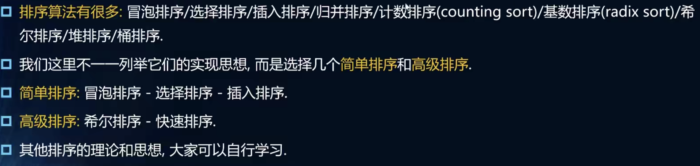

### 冒泡排序
#### 思路
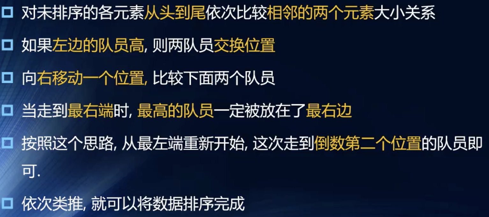

#### 代码解析
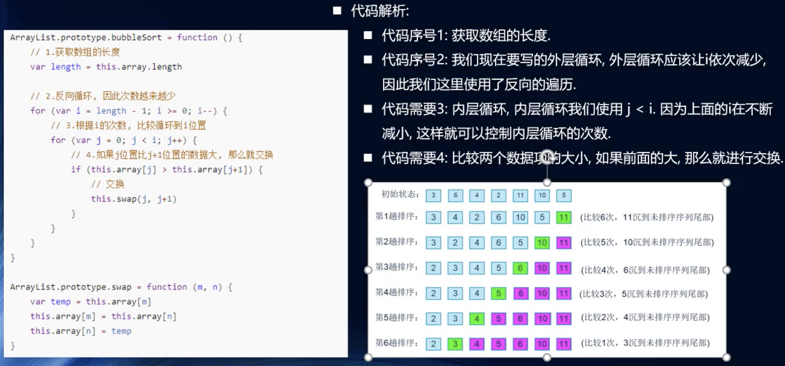

#### 效率
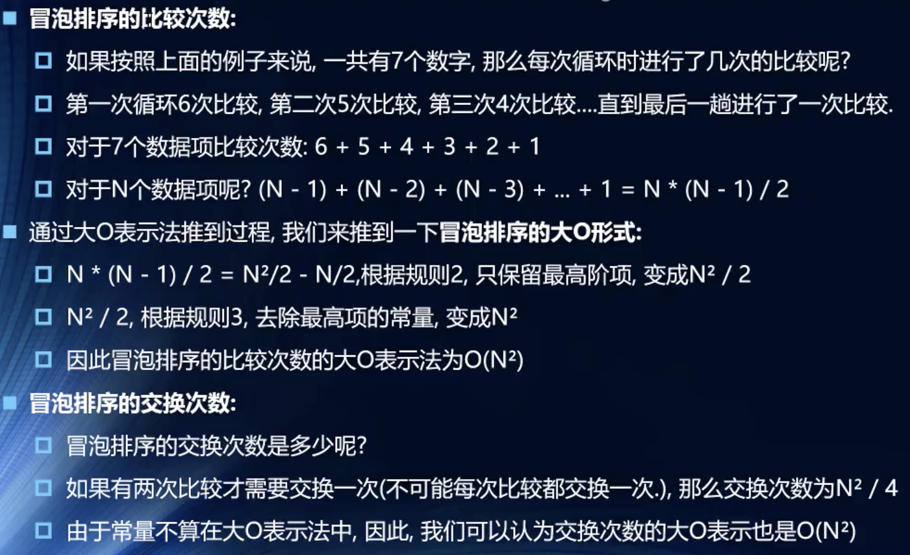

### 选择排序
#### 思路
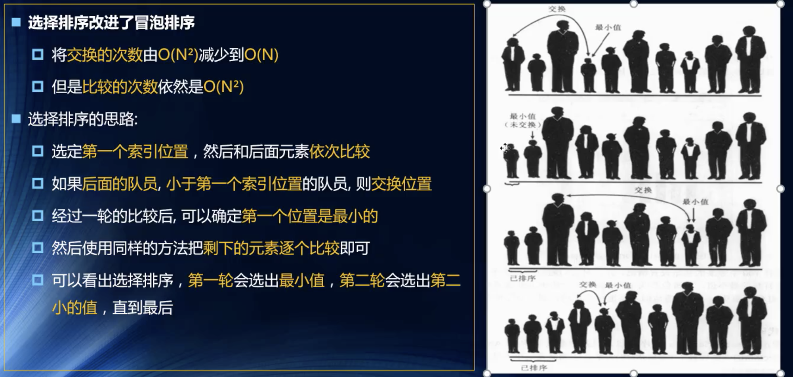

#### 代码解析
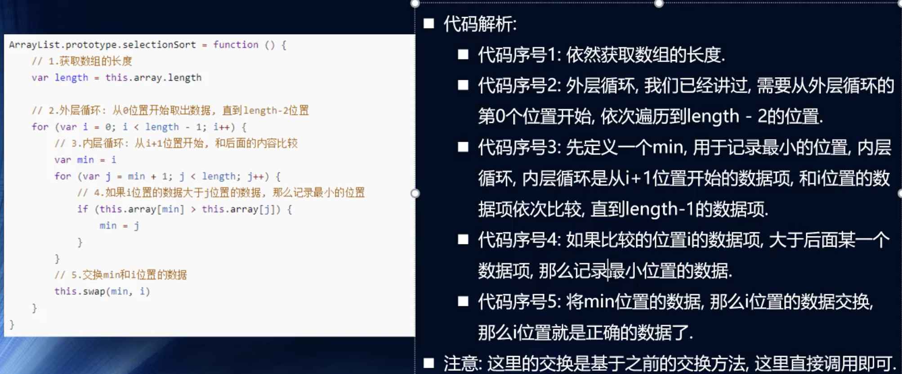

#### 效率

### 插入排序
#### 思路
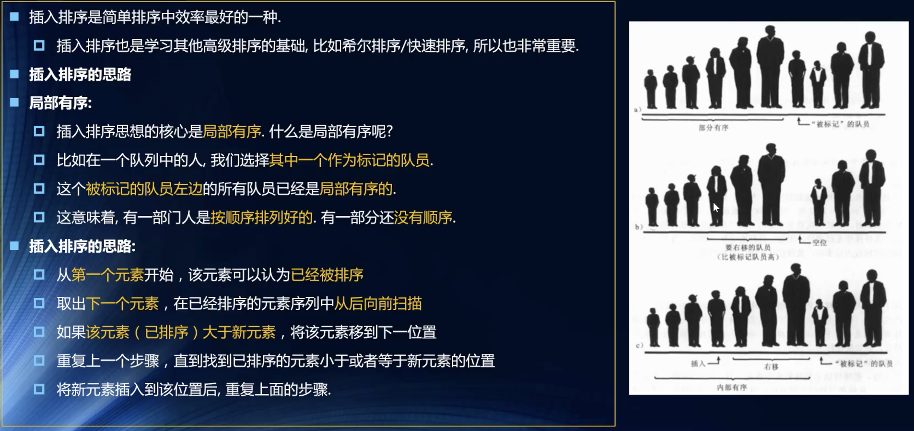

#### 效率
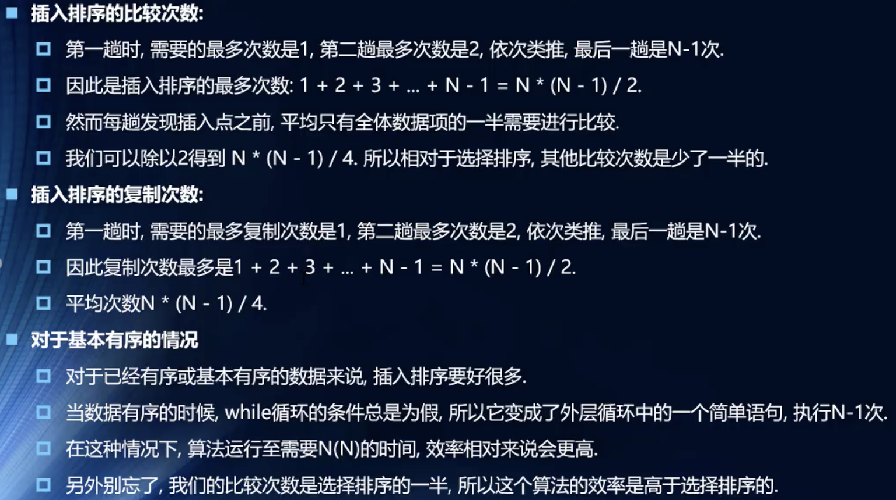

### 希尔排序
#### 思路
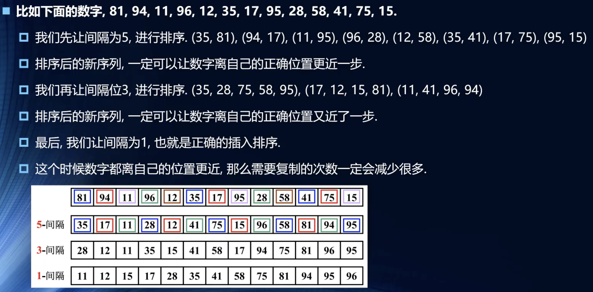

#### 希尔原稿做法
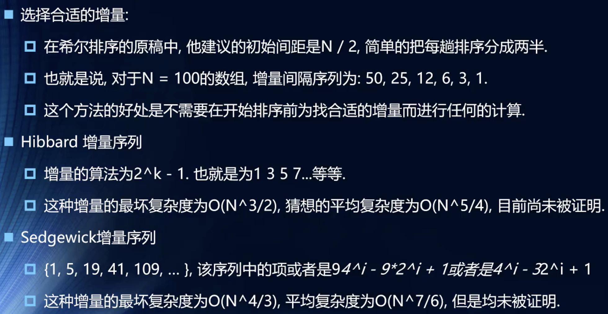

#### 效率
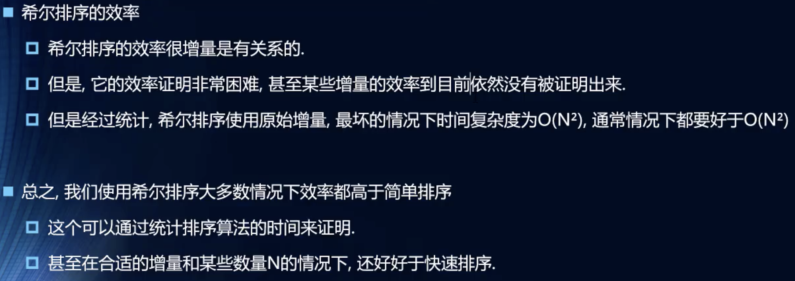

### 快速排序
#### 简介
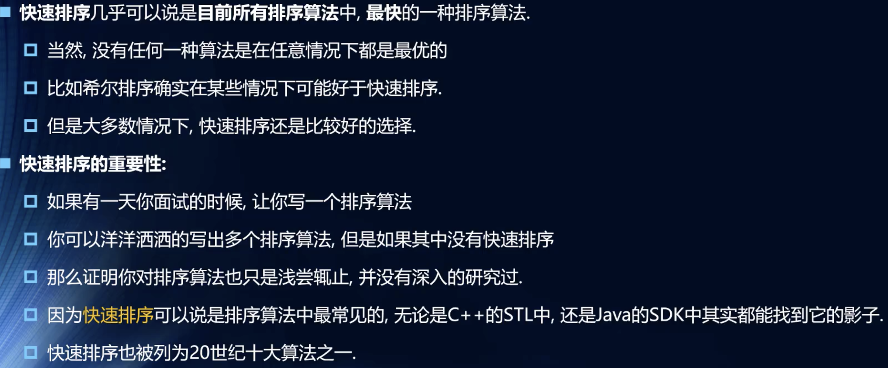

#### 效率
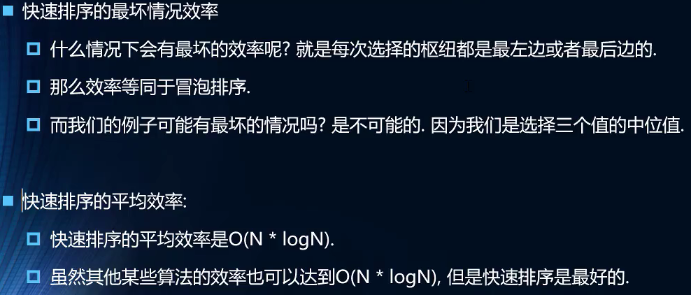