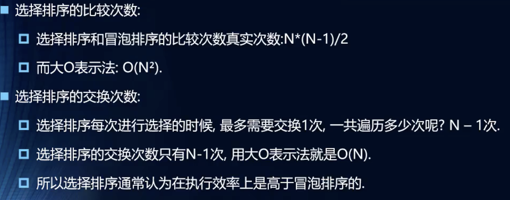

# 算法

## 大O表示法
### 常见大O表示形式

### 效率

### 推到大O表示法的方式

## 排序算法
### 常见排序算法

### 冒泡排序
#### 思路

#### 代码解析

#### 效率

### 选择排序
#### 思路

#### 代码解析

#### 效率

### 插入排序
#### 思路

#### 效率

### 希尔排序
#### 思路

#### 希尔原稿做法

#### 效率

### 快速排序
#### 简介

#### 效率
