# 树

## 数组
### 优点
- 根据***下标值访问***效率会很高。
- 如果根据元素查找，比较好的方式是先对数组进行***排序***，在进行***二分查找***。

### 缺点
- 需要先对数组进行***排序***，生成***有序数组***，才能提高查找效率。
- 另外数组插入和删除数据时，需要有大量的***位移操作***（插入到首位或者中间位置的时候），效率很低。

## 链表
### 优点
- 插入和删除操作效率都很高。

### 缺点
- ***查找***效率很低，需要从头开始依次访问链表中的每个数据项，直到找到。
- 即使插入和删除操作效率很高，但是如果要插入和删除中间位置的数据，还是需要重头先找到对应的数据。

## 哈希表
### 优点
- 插入/查询/删除的效率非常高。

### 缺点
- ***空间利用率不高***，底层使用的数组，并且某些单元是没有被利用。
- 哈希表中的元素是***无序***的，不能按照固定的顺序来遍历哈希表中的元素。
- 不能快速的找出哈希表中的***最大值或者最小值***等特殊值。

## 树结构
- 树结构综合了上面的数据结构的优点（当然优点不足以盖过其他数据结构，比如效率一般情况下没有哈希表高）。
- 并且弥补了上面数据结构的缺点。

### 应用场景
- 因为数据结构的非线性的，可以表示一对多的关系。
- 比如文件的目录结构。

### 介绍
- 树：n(n >= 0)个节点构成的***有限集合***。
    - n=0,为空树。

- 对于任一棵非空树（n > 0），具备以下性质：
    - 根（root), 用r表示。
    - 其余节点可分为m(m>0)个互不相交的有限集T1,T2, ... , Tm，其中每一个集合本身又是一棵树，称为原来树的子树。

### 树的术语
- 节点的度（Degree）：节点的***子树个数***。
- 树的度：树的所有节点中***最大的度数***。
- 叶节点（Leaf）：***度为0的节点***（也称为叶子节点）。
- 父节点（Parent）：有子树的节点是其子树的根节点的父节点。
- 子节点（Child）：若A节点是B节点的父节点，则B节点是A节点的子节点，子节点也称孩子节点。
- 兄弟节点（Sibling）：具有同一父节点的各节点彼此是兄弟节点。
- 路径和路径长度：从节点n1到nk的路径为一个节点序列n1,n2, ... , nk, ni是ni+1的父节点。路径所包含b边的个数为路径长度。
- 节点的层次（Level）：规定***根节点在1层***，其他任一节点的层数是其父节点的***层数加1***。
- 树的深度（Depth）：树中所有节点中的***最大层次***是这棵树的深度。

## 二叉树 - 任何树都可以用二叉树最终模拟出来
二叉树：树中每个节点最多只能有两个子节点。

### 二叉树的定义
- 二叉树可以为空，也就是没有节点。
- 若不为空，则它是由根节点和称为其左子树TL和右子树TR的两个不相交的二叉树组成。

### 二叉树有五种形态
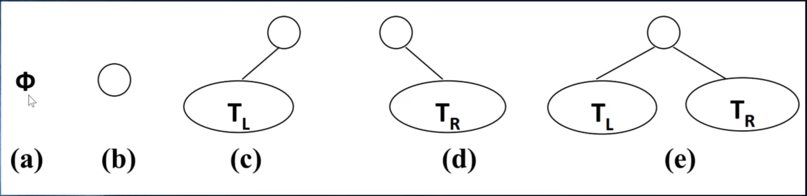

### 二叉树的特性
- 一个二叉树第i层的最大节点数为：2^(i-1), i >= 1。
- 深度为k的二叉树有最 大节点总数为：2^k-1, k >= 1。
- 对任何非空二叉树 T，若n0表示叶节点的个数、n2是度为2的非叶节点个数，那么两者满足关系n0=n2+1。

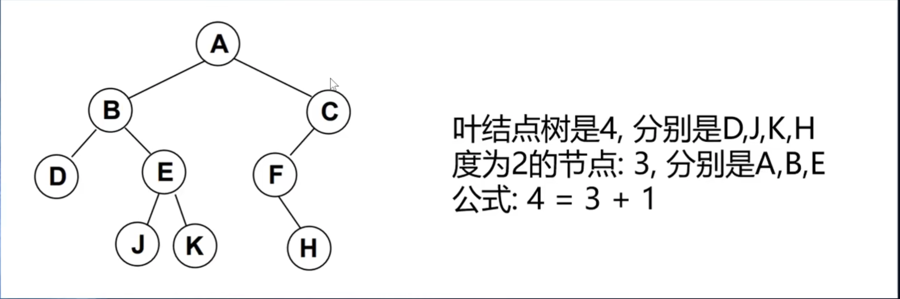

### 完美二叉树
完美二叉树（Perfect Binary Tree）,也成为满二叉树（Full Binary Tree）。
- 在二叉树中，除了最下一层的叶节点外，每层节点都有2个子节点，就构成了满二叉树。

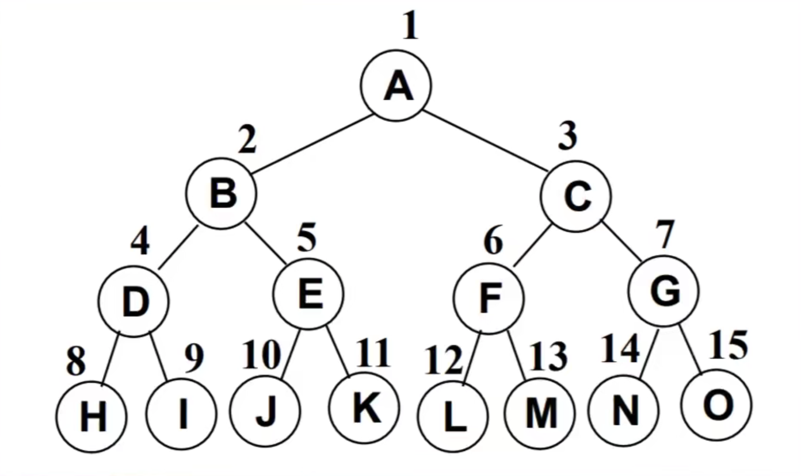

### 完全二叉树（Complete Binary Tree）
- 除二叉树最后一层外，其他各层的节点数都达到最大个数。
- 且最后一层从左向右的叶节点连续存在，只缺右侧若干节点。
- 完美二叉树是特殊的完全二叉树。

下面不是完全二叉树，因为D节点还没有右节点，但是E节点就有了左右节点。
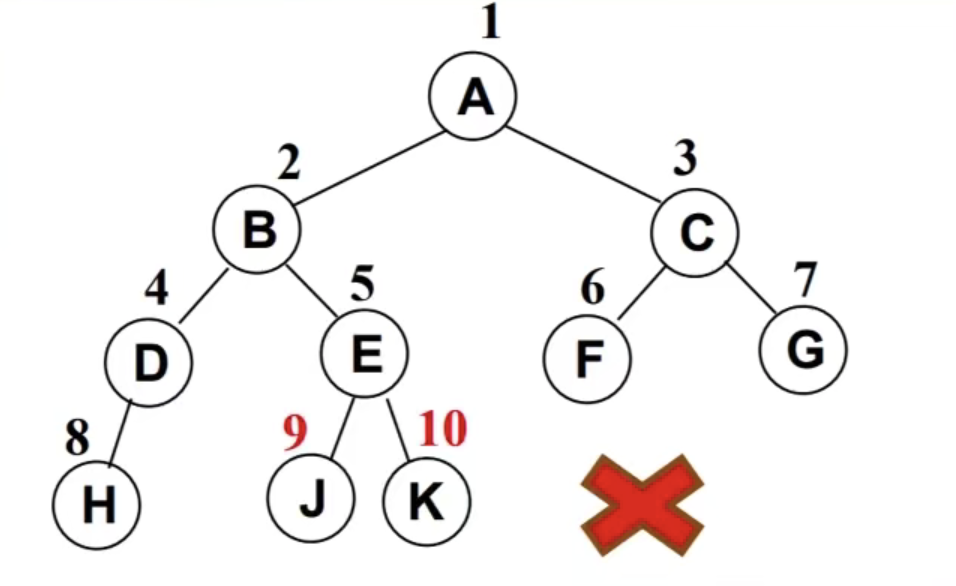

### 二叉树的存储
二叉树的存储常见的方式是数组和链表。

#### 使用数组
- 完全二叉树：按从上到下、从左到右顺序存储。
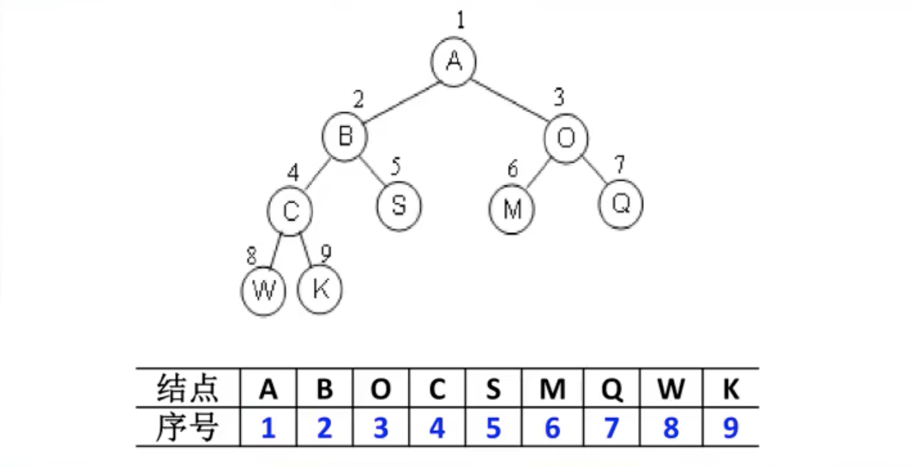

- 非完全二叉树
    - 非完全二叉树要转换成完全二叉树才可以按照上面的方案存储。
    - 但是会造成很大的空间浪费。

    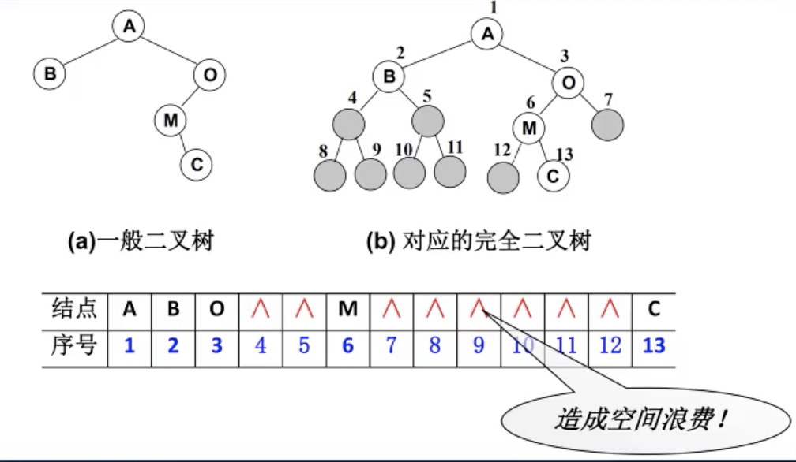

#### 使用链表
二叉树最常见的方式还是使用链表存储。
- 每个节点封装成一个Node,Node中包含存储的数据，左节点的引用，右节点的引用。
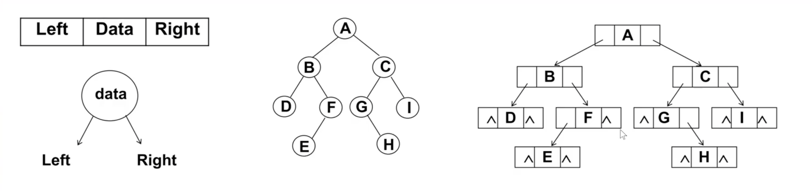

### 二叉搜索树
- 二叉搜索树（BST, Binary Search Tree）, 也称***二叉排序树***或***二叉查找树***。
- 二叉搜索树是一个二叉树，可以为空。
- 如果不为空，满足以下性质：
    - 非空左子树的所有键值小于其根节点的键值。
    - 非空右子树的所有键值大于其根节点的键值。
    - 左右子树本身也都是二叉搜索树。
- 如下图：
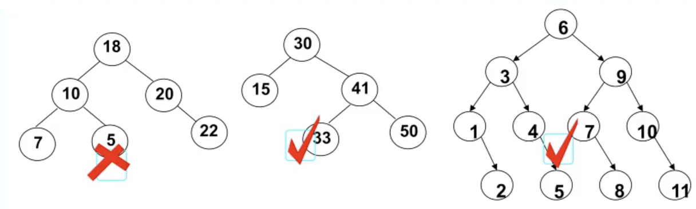

- 二叉搜索树的特点
    - 二叉搜索树的特点就是相对***较小的值***总是保存在***左节点***上，相对***较大的值***总是保存在***右节点***上。
    - 查找效率非常高，这也是二叉搜索树中，搜索的来源。

### 二叉搜索树方法
#### 先序遍历
- 访问根节点。
- 先序遍历其左子节点。
- 先序遍历其右子节点。
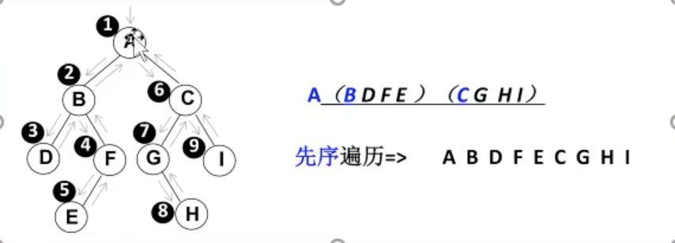
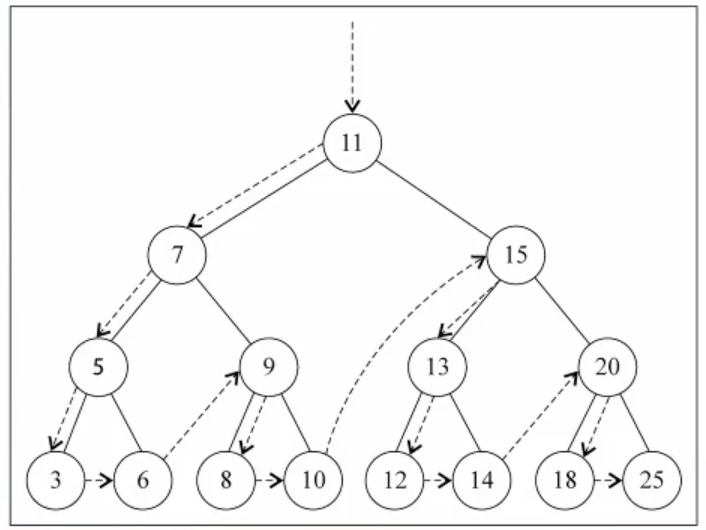

#### 中序遍历
- 中序遍历其左子节点。
- 访问根节点。
- 中序遍历其右子节点。
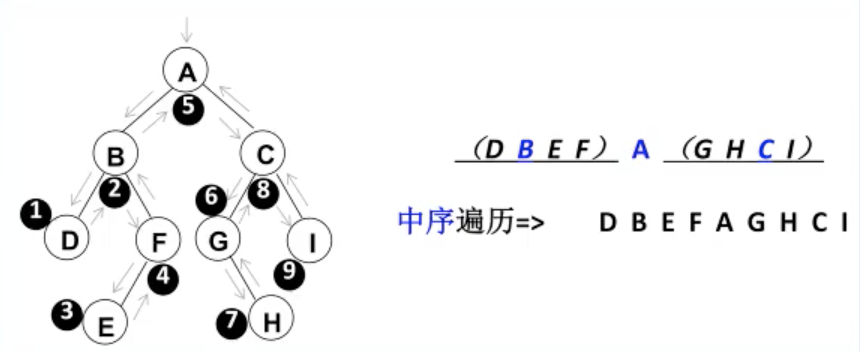
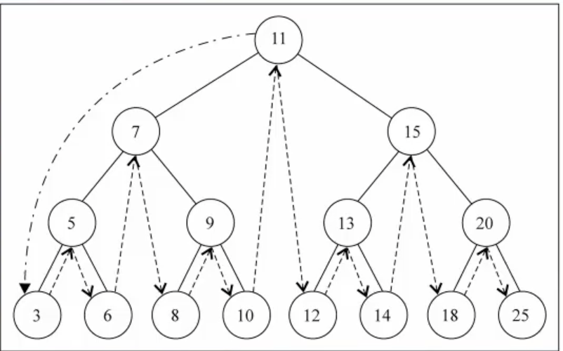

#### 后序遍历
- 后序遍历其左子节点。
- 后序遍历其右子节点。
- 访问根节点。
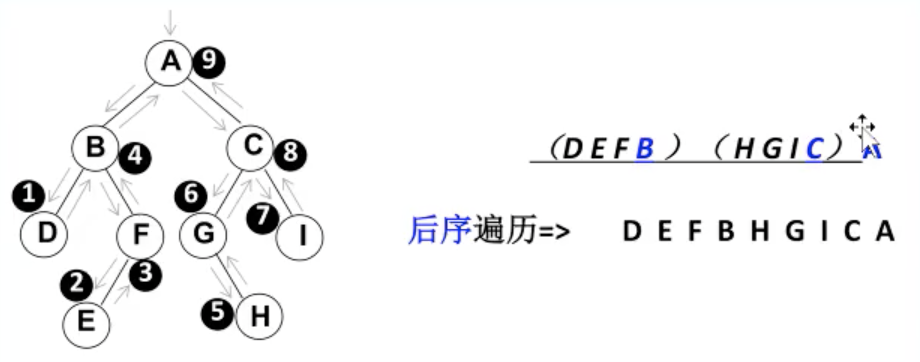
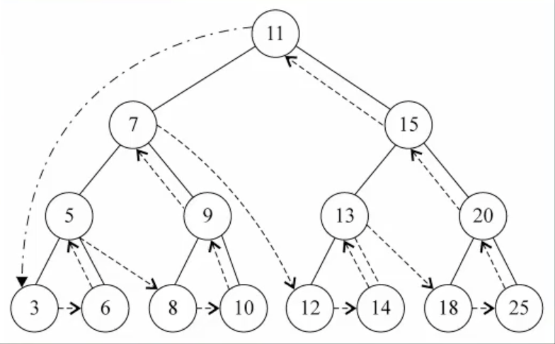

#### 最大值&最小值
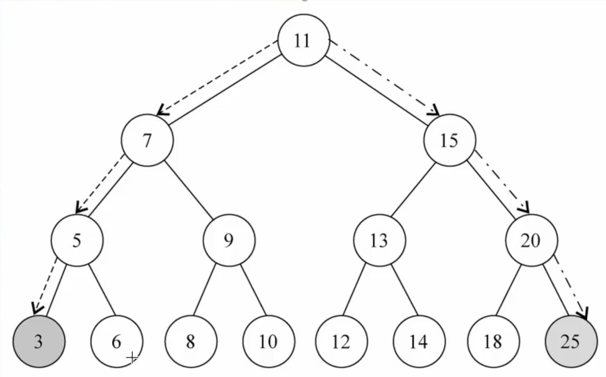

#### 删除
- 该节点是叶节点（没有子节点，比较简单）。
- 该节点有一个子节点（也相对简单）。
- 该节点有两个子节点（情况比较复杂）。
